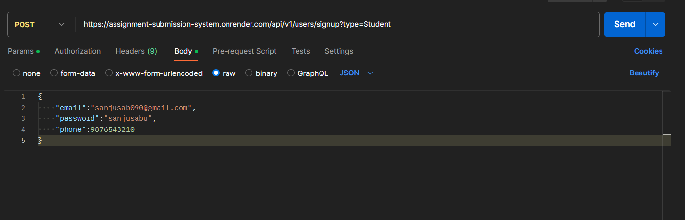
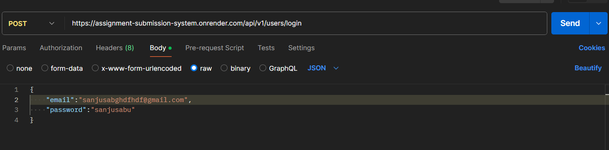
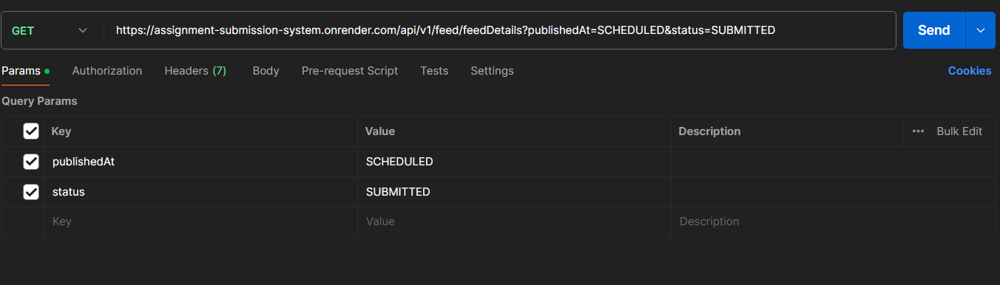
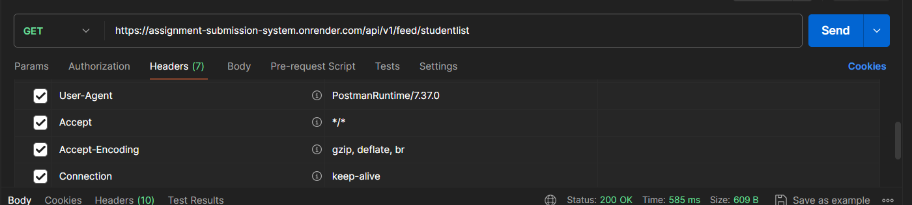
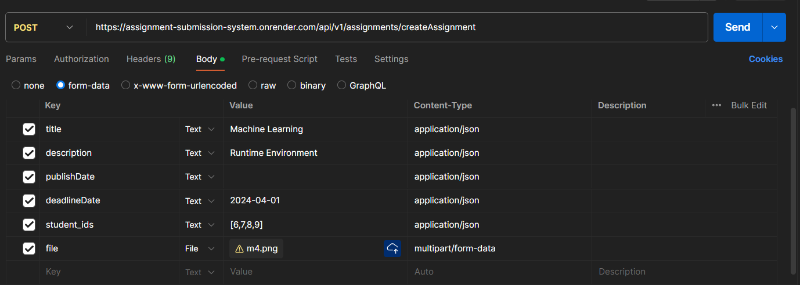
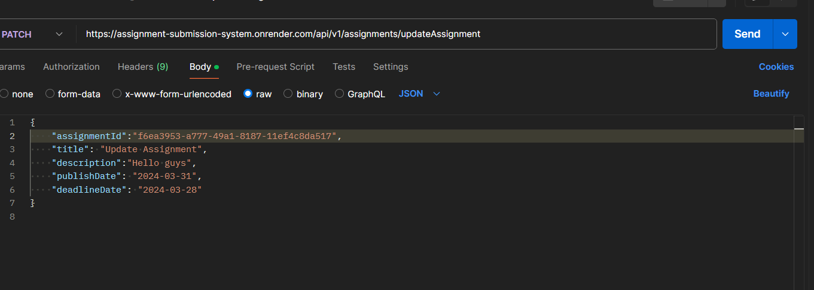
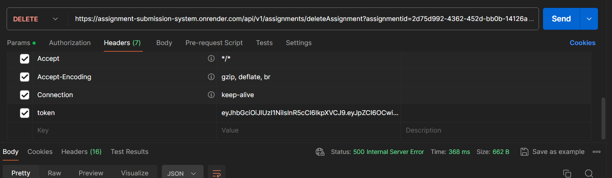
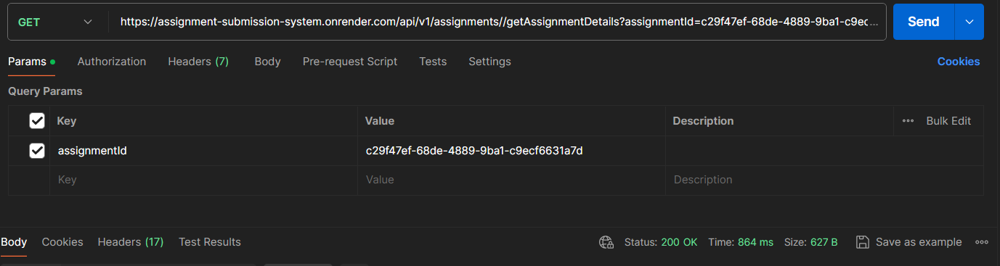
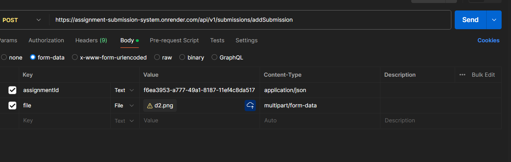

## Deployment

Deployed Endpoint - https://assignment-submission-system.onrender.com/api/v1/

## Setup the project

 - Download this template from github and open it in your favourite text editor.
 - Go inside the folder path and execute the following command.
    
        npm install
        npm start
    
 - In the root directory creater a `.env` file and add the follwing env variables
    
        CLOUD_NAME=<client name of Cloudinary>
        API_KEY = <api key of cloudinary>
        API_SECRET = <api secret of cloudinary>
        JWT_SECRET = <jwt secret string>
        Sendpassword = <oauth password>
        HOST = <host name of DB>
        DATABASE = <database name>
        DBUSER = <database user name>
        DBPASSWORD = <database user's password>
        DBPORT = <database port number>


- Add the necessary env variables in the `.env` file inside the src folder and run nodemon index.js to run locally.

## Tech Stack

Server: NodeJS, ExpressJS, RestAPIs, MySQL(Deployed on clevercloud)

Middleares/libraries : Multer,JWT,bcrypt

## API Reference

API DOCS - Present in the Repo as Virtual Classrooom.postman_collection.json

### Authentication APIs

#### Register User

http
  ```POST /users/signup```

  Body :Email,Password and Phone Number is taken as input and registered through the bcrypt module.

  Query Params : type: Student/Tutor

  

#### Login User

http
  ```POST /user/login```
  Body: email, password
  The password is hashed so as to maintain integrity and a token is generated as well which is used further in the apis for authentication thorugh auth middlewares.

  

### User Feed APIs

#### Get User Feed - Protected

http
```GET /feed/feedDetails```
    Headers: token

    Query Params: publishedAt(ONGOING/SCHEDULED) and status(ALL/PENDING/SUBMITTED/OVERDUE)
    Gets all the assignments published for that student and the assignments created by the tutor

Fetch the feed for the user which is logged in. Detects the role of the user by Auth Token and presents the feed accordingly.


http
```GET /feed/studentlist``` - For Tutors Only

    Headers: token
    Gets all the list of all students

Fetch the feed for the user which is logged in. Detects the role of the user by Auth Token and presents the feed accordingly.



### CRUD Assignment APIs For Tutors

#### Create Assignment - Protected

http
  ```POST /assignments/createAssignment```

    Headers:  token - Authenticates the user through the token.
    Body: File,name,description,list of student ids
    File is optional and the list of student_ids that are allowed have also been checked, errors have been handled. 
    File is uploaded to cloudinary and then is stored as alink in the Assignment_Details Database.



#### Update Existing Assignment - Protected

http
    ```PATCH /assignments/updateAssignment ```

    Headers:  token - Authenticates the user through the token
    Updates the Assignment by the assignmentId and other details that need to be updated.



#### Delete an Assignment  - Protected

http
    DELETE ```/assignments/deleteAssignment```

    Headers: token - Authenticates the user through the token
    Delete an assignment using the assignmentid as a query parameter.



### For Tutor and Students 
 http
    GET ```/assignments/getAssignmentDetails```

    Query Param - AssignmentID
    Tutor - All Students Submission for that Assignment
    Student -  Student’s submission for that Assignment



### Assignment Submission (For Student)
http 
    POST ```/submissions/addSubmission```

    Headers: token - Authenticates the user through the token
    Body : File(Multipart/form-data) and AssignmentID in Json

    Adds the submission and updates the status to Submitted in the Assigned Table for that AssignmentID.

